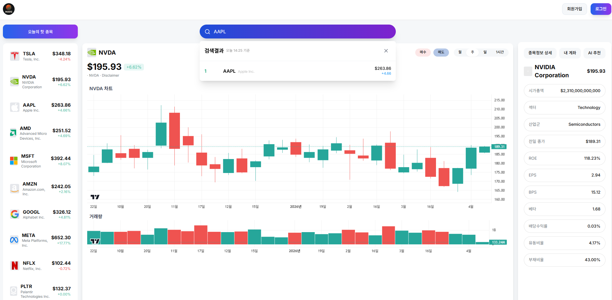
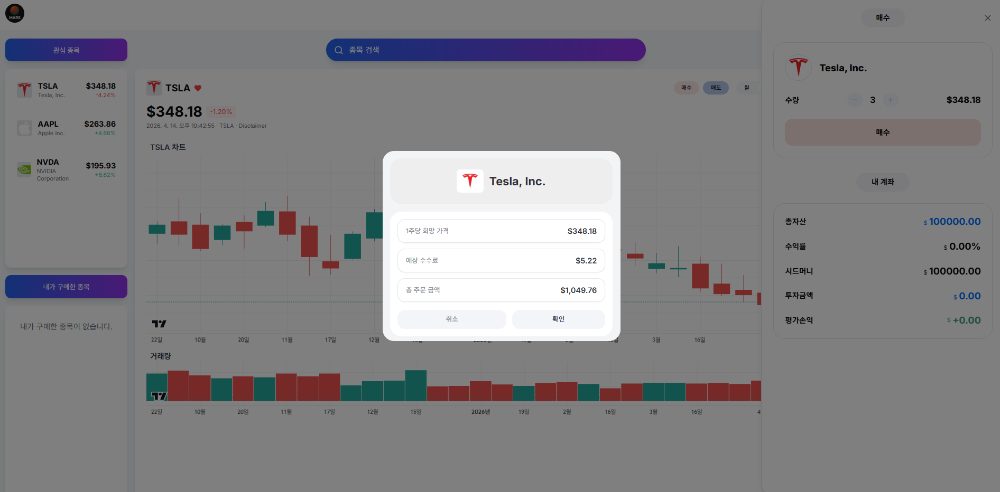
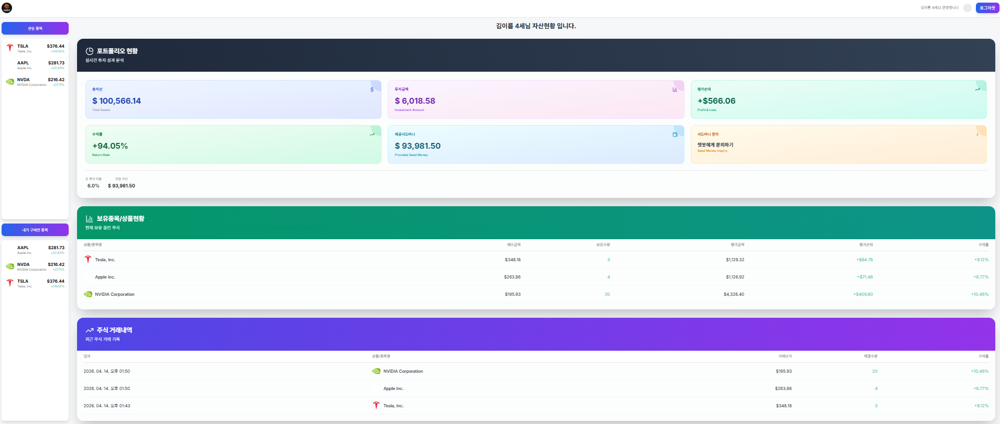
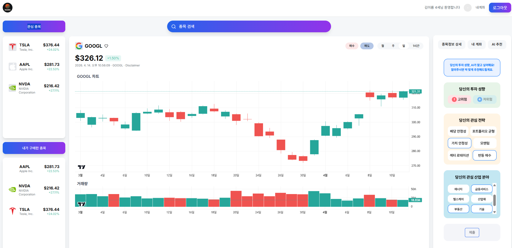
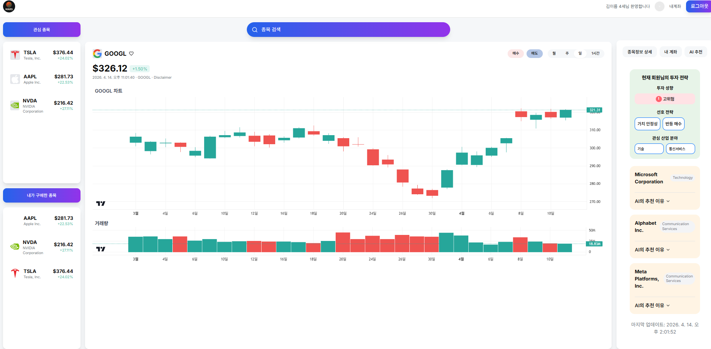
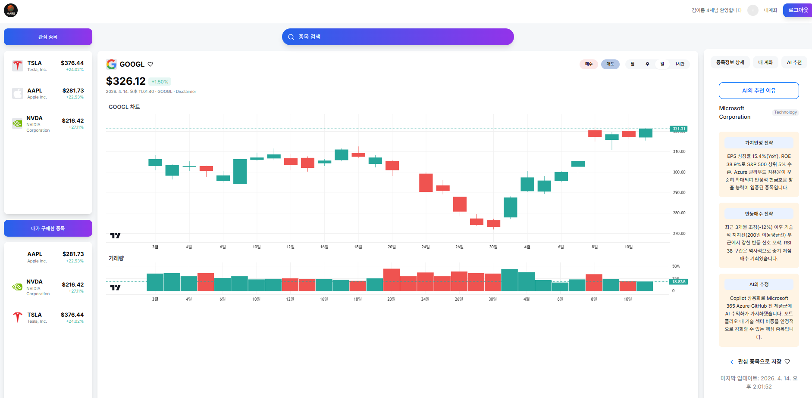
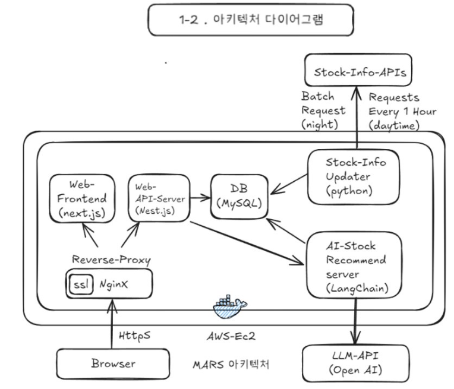

# MARS — S&P 500 모의투자 및 AI 추천 플랫폼 (회고 문서)

> **Note**: 본 프로젝트는 서울시 주관 부트캠프의 팀 프로젝트(4명)였으며,
> 본인은 팀장으로서 백엔드·인프라·데이터 파이프라인·AI 추천 엔진을 
> 담당했습니다. 본 레포는 프로젝트 전반의 아키텍처와 본인 담당 영역, 
> 그리고 팀 리드 경험에서 얻은 교훈을 정리한 회고 문서입니다.

---

## 🎯 프로젝트 배경과 이 회고의 성격

MARS는 서울시 주관 부트캠프의 팀 프로젝트(4명, 약 4개월)로 시작됐습니다. 
본인은 팀장이자 백엔드 담당이었고, 프론트엔드는 2명으로 확정되어 
있었습니다. 남은 한 자리는 AI 추천과 데이터 수집 작업에 배치되었고, 
해당 팀원이 AI 쪽 작업을 희망한 것이 결정의 주된 근거였습니다.

프로젝트 당시 본인은 JavaScript 기반 웹 개발자 커리어를 염두에 두고 
있었고, 백엔드 개발 자체에 관심이 집중되어 있었습니다. Python이나 
AI 기술 쪽은 팀 내에서 별도로 맡길 수 있는 영역이라고 생각했고, 
이 프로젝트를 마친 뒤에야 그 인식이 바뀌었습니다.

이 README는 그런 **전환점에 있었던 프로젝트**에 대한 회고입니다. 
당시의 한계와 판단 실수를 정리하는 문서인 동시에, 1년차 팀장으로서 
예상치 못한 상황에 대응한 경험을 기록해두는 자료이기도 합니다.

---

## 📜 프로젝트 개요

**MARS**는 S&P 500 실시간 데이터를 기반으로 한 모의투자 웹 서비스이자, 
사용자의 투자 성향과 시장 상황을 분석해 종목을 추천하는 AI 기반 플랫폼 
프로토타입입니다.

- **작업 기간**: 2025.03 ~ 2025.07 (약 4개월)
- **팀 구성**: 4인 (프론트엔드 2, 백엔드 1, 잔여 인력 1)
- **본인 역할**: 팀장 / 백엔드 / 인프라 / 데이터 수집 / AI 추천 엔진 
  (프로젝트 진행 중 범위가 확장)
- **상태**: 부트캠프 종료 후 유지보수 중단. 본 문서는 2026년 4월 회고 
  작성 시점에 로컬에 복구하여 화면을 촬영함.

---

## 📦 소스 코드

전체 소스는 [WeGoMars GitHub Organization](https://github.com/WeGoMars)에서 확인할 수 있습니다.

| 레포 | 담당 | 링크 |
|------|------|------|
| **mars-be** | 백엔드 (NestJS) — 본인 작성 | [→](https://github.com/WeGoMars/mars-be) |
| **stock-scrapper** | 데이터 수집 파이프라인 (Python) — 본인 작성 | [→](https://github.com/WeGoMars/stock-scrapper) |
| **ai-recommendations** | AI 추천(?) 엔진 (LangChain) — 본인 작성 | [→](https://github.com/WeGoMars/ai-recommendations) |
| **infra** | Docker/Nginx/CI-CD 설정 — 본인 작성 | [→](https://github.com/WeGoMars/infra) |
| **docs** | API 명세 문서 | [→](https://github.com/WeGoMars/docs) |
| **mars-fe** | 프론트엔드 (Next.js) — 팀원 작성 | [→](https://github.com/WeGoMars/mars-fe) |

---

## 🖼️ 실행 화면

### 1. 메인 화면 — 실시간 시장 데이터와 종목 정보



왼쪽의 "오늘의 핫 종목" 리스트는 데이터 수집 모듈이 주기적으로 갱신한 
결과이며, 우측 사이드바에는 해당 종목의 재무지표(시가총액, ROE, EPS, 
BPS, 베타, 배당수익률, 유동비율, 부채비율)가 표시됩니다. 차트는 
TradingView 스타일의 캔들 차트로 일봉/주봉/월봉/1시간봉을 지원합니다.

### 2. 매수 주문 — 수수료까지 계산한 모의 거래



매수 주문 시 1주당 가격, 예상 수수료, 총 주문 금액이 자동 계산됩니다. 
실제 증권 거래와 유사한 경험을 의도한 설계입니다.

### 3. 포트폴리오 현황 — 시간 경과 후 수익률 반영



매수 이후 시간이 지나 평가손익이 반영된 상태입니다. 총자산, 투자금액, 
수익률, 보유 종목별 손익, 최근 거래 내역이 한 화면에 집약됩니다. 
(본 스크린샷은 회고 작성 시점에 복구하며 더미 데이터로 수익률을 
조정한 상태입니다)

### 4. AI 추천 설정 — 사용자 투자 성향 입력



사용자는 투자 성향(고위험/저위험), 관심 전략(6가지 중 다중 선택), 
관심 산업 분야를 입력합니다. 이 정보가 이후 설명할 4단계 AI 파이프라인의 
입력이 됩니다.

### 5. AI 추천 결과 — 선택된 전략 기반 종목 리스트



Parser → Strategist → Analyst → Commenter 파이프라인을 거친 최종 
추천 결과가 제시됩니다. 선택된 3개 전략 태그와 추천 종목이 함께 
표시됩니다.

### 6. AI 추천 상세 — 종목별 전략 기반 해설



각 추천 종목에 대해 LLM이 선택된 전략별 근거 해설을 작성합니다. 
*이 해설 생성 방식의 실제 구조와 한계는 아래 회고 섹션에서 다룹니다.*

---

## 🏛️ 시스템 아키텍처



AWS EC2 위에 Docker로 컨테이너화된 서비스들이 Nginx 리버스 프록시 
뒤에서 동작하는 구조입니다.

| 컴포넌트 | 역할 |
|---------|------|
| **Web Frontend** (Next.js) | 사용자 UI |
| **Web API Server** (NestJS) | 회원 관리, 거래 로직, 포트폴리오 계산 |
| **Stock Info Updater** (Python) | 외부 API를 통한 주식 정보 수집 |
| **AI Recommend Server** (LangChain) | 4단계 파이프라인 기반 종목 추천 |
| **MySQL** | 사용자·종목·거래·시장 데이터 저장 |
| **Nginx** | 리버스 프록시, HTTPS(SSL) 처리 |

전체 서비스는 **멀티 레포 구조**로 관리되었습니다. 이 결정은 회고 
섹션에서 재평가합니다.

---

## 🛠️ 기술 스택

| 레이어 | 사용 기술 |
|--------|----------|
| Frontend | Next.js, TypeScript |
| Backend | NestJS, Prisma, TypeScript |
| Data Pipeline | Python, SQLAlchemy |
| AI / LLM | LangChain, OpenAI API |
| Database | MySQL |
| DevOps | Docker, Nginx, AWS EC2, GitHub Actions |

---

## 👤 담당 영역

### 1. NestJS 기반 백엔드 — 거래 시뮬레이션과 포트폴리오 관리

JWT 기반 사용자 인증, 매수/매도 주문 처리, 포트폴리오 실시간 수익률 
산출 등 모의투자의 핵심 비즈니스 로직을 구현했습니다. 수수료 계산을 
포함한 거래 처리와, 보유 종목의 평가손익을 현재가 기준으로 갱신하는 
로직이 주 작업이었습니다.

이 부분의 비즈니스 로직 자체는 전형적인 CRUD + 서비스 계층 구조이며, 
특별히 회고할 만한 설계 결정은 많지 않습니다. 다만 두 가지 의식적인 
선택이 있었습니다.

**하나는 API 명세 문서를 Markdown으로 직접 작성한 것**입니다. 프론트엔드 
팀원들이 백엔드 API를 막힘없이 연동할 수 있도록, 전체 엔드포인트의 
요청 형식, 응답 구조, 에러 케이스를 도메인별로 나눠 수기 문서화했습니다. 

- 실제 문서는 [api_docs/](./api_docs/)에서 확인할 수 있습니다.


NestJS에도 `@nestjs/swagger` 패키지를 이용한 자동 문서화 방법이 있다는 
것은 당시에도 알고 있었지만, 데코레이터 기반 어노테이션을 전체 엔드포인트에 
부착하는 작업량이 만만치 않았고, 그것이 다음 항목에서 설명할 "코드베이스를 
간결하게 유지한다"는 원칙과도 충돌했기 때문에 수기 작성을 선택했습니다. 
작업량은 많았지만 덕분에 프론트엔드와의 연동 과정에서 "이 필드 뭐에요?"류의 
질문이 거의 발생하지 않았고, 팀 속도가 유지됐습니다.

특히 거래 엔드포인트(`POST /api/trades/buy`, `POST /api/trades/sell`)에는 
**클라이언트가 받아온 시점의 주식 가격과 서버 시점의 주식 가격이 다를 
때 거래를 거부하는 검증**을 포함시켰습니다. 모의투자라 해도 가격 
정합성은 금융 서비스의 기본이라고 생각했고, 이 부분은 낙관적 락 
패턴에 해당한다는 것을 나중에야 알게 됐습니다.

**다른 하나는 코드베이스를 의도적으로 간결하게 유지한 것**입니다. 당시 
저는 프레임워크 경험이 없는 팀원에게 NestJS를 학습시켜 일부 작업을 
맡겨보려는 계획을 가지고 있었습니다. 그 팀원이 코드를 읽고 수정할 수 
있으려면 구조가 단순해야 했기에, 추상화 레이어를 쌓거나 재사용을 
위한 복잡한 패턴을 도입하는 것을 의식적으로 피했습니다. 이 계획은 
결과적으로 계획대로 진행되지 못했지만, 단순한 구조가 주는 가독성의 
이점은 제가 혼자 전체 코드를 유지보수하게 된 이후에도 도움이 됐습니다.

### 2. 데이터 수집 파이프라인 — 외부 API 조율

S&P 500 전 종목의 OHLCV, 재무지표, 시장지수를 외부 API로 수집해 
MySQL에 적재하는 배치/실시간 파이프라인을 담당했습니다. Yahoo Finance, 
FRED, FMP, TwelveData 등 4개 API를 조율했고, 무료 플랜의 rate limit을 
회피하기 위해 여러 API 키를 라운드로빈으로 순환시키는 방식을 적용했습니다.

이 컴포넌트는 Cursor의 코드 생성 도움을 많이 받았고, 품질 면에서는 
"동작하는 데모 수준"에 머물렀습니다. 다만 "여러 계정을 만들어 API 키를 
순환시킨다"는 rate limit 우회 아이디어는 본인의 판단이었고, 외부 
의존성의 제약을 우회하는 접근으로 지금도 유효한 방식이라고 봅니다.

### 3. AI 추천 엔진 — 4단계 LLM 파이프라인

사용자의 포트폴리오 현황과 시장 환경을 입력으로 받아, 6가지 투자 전략 
중 3개를 LLM이 선택하고, 각 전략별로 종목을 스코어링한 뒤, 상위 종목에 
대해 LLM이 근거 해설을 생성하는 4단계 파이프라인입니다.

```
사용자 요청 (포트폴리오 + 시장 데이터)
↓
[1] Parser: 데이터 정규화 → Markdown 변환
↓
[2] Strategist (LLM): 6가지 전략 중 3개 선택
↓
[3] Analyst: 각 전략별 종목 스코어링 → 상위 종목 통합
↓
[4] Commenter (LLM): 각 종목별 근거 해설 생성
↓
JSON 응답 반환
```
6가지 투자 전략은 사전에 정의된 규칙 기반이며, 배당 안정성, 포트폴리오 
분산, 가치 투자, 모멘텀, 섹터 로테이션, 반등 매수로 구성됩니다. 
각 전략마다 별도의 Fetcher 함수가 있어 해당 전략에 맞는 지표로 종목을 
필터링하고 점수를 매깁니다.

**이 시스템의 성격과 한계는 회고 2번에서 다룹니다.** 먼저 중요한 것은, 
이 엔진이 **원래 계획보다 훨씬 짧은 일정**에 급조되었다는 점입니다.

### 4. CI/CD 및 배포 인프라

GitHub Actions로 특정 브랜치 푸시 시 AWS EC2에 자동 배포되는 파이프라인을 
구축했습니다. Nginx 리버스 프록시에 Let's Encrypt 인증서를 적용해 
HTTPS를 지원했고, 도메인을 연결해 실제 배포 환경과 유사한 구성을 
만들었습니다.

이 자동 배포 파이프라인은 단순한 배포 자동화를 넘어, **로컬에 전체 
시스템을 구축하기 어려운 팀원들이 자기 변경사항을 실제로 테스트할 
수 있는 경로**로도 기능했습니다. 테스트용 브랜치를 별도로 파고 해당 
브랜치에 푸시할 때도 자동 배포가 돌도록 설정해, 메인 브랜치를 깨끗하게 
유지하면서도 실제 환경에서 기능을 검증할 수 있게 했습니다. 멀티 레포 
구조가 만든 로컬 개발의 어려움을, CI/CD 인프라로 일부 우회하는 구조 
였다고 할 수 있습니다.

---

## 🔍 회고 및 한계 (Lessons Learned)

이 프로젝트의 회고는 세 가지 축으로 나뉩니다. 하나는 팀 리드로서 
마주한 현실, 하나는 급조된 AI 추천 엔진의 구조적 한계, 그리고 
프로젝트 초기에 내린 판단 중 하나에 대한 뒤늦은 재평가입니다.

### 1. 팀 리드 경험의 첫 현실 — 역할 재배치와 우선순위 조정

초기 역할 배치에서 AI 추천과 데이터 수집은 프론트/백엔드가 아닌 남은 
한 팀원에게 맡겨졌습니다. 프로젝트 진행 중 해당 영역의 진척이 어려워 
지면서 저는 여러 차례 역할 재배치를 시도했습니다. AI 쪽이 어려우니 
백엔드 일부를 분담하게 해봤고, 백엔드도 어려워지자 DevOps 쪽으로 
옮겨봤는데, 각 영역마다 유사한 어려움이 이어졌습니다. 결국 데이터 
파이프라인, 백엔드, AI 추천 엔진, 인프라를 모두 제가 담당하는 구조가 
되었습니다.

이 과정에서 AI 추천 엔진은 원래 계획보다 훨씬 짧은 일정(실질적으로 
3일)에 구현해야 했습니다. 부트캠프의 AI 요구사항은 충족해야 했고, 
철야 끝에 "동작하는 데모" 수준의 시스템을 완성했습니다. 당시에도 이 
시스템의 스코어링 로직이 통계적 근거가 부족하다는 것은 인지하고 
있었지만, 시간 예산 안에 가중치 튜닝이나 검증 구조를 설계할 여유는 
없었습니다.

이 경험이 남긴 것은 두 가지입니다.

하나는 **팀원의 실제 역량을 프로젝트 초기 단계에서 파악하는 것의 
어려움**입니다. 제가 당시 내린 역할 배치는 각 팀원의 선호와 관심을 
존중하는 방식이었지만, 선호와 실제 수행 가능 역량은 다를 수 있다는 
것을 실행 과정에서 배웠습니다. 이후 팀으로 일할 기회가 있다면, 초기 
단계에서 작은 범위의 과제로 역량을 확인하는 절차를 의식적으로 
포함하는 것이 필요하다고 생각하고 있습니다.

다른 하나는 **불완전한 시스템이라도 요구사항 기한 안에 동작하는 상태로 
만드는 판단력**입니다. "AI 추천 기능을 빼고 모의투자만 남길 것인가, 
아니면 한계를 인지한 상태로 급조해서 넣을 것인가"라는 선택지 앞에서, 
저는 "기한 내에 요구사항을 충족하는 것"을 택했습니다. 이 판단이 최선 
이었는지는 여전히 확신할 수 없지만, 적어도 당시의 제약 안에서 내린 
의식적인 결정이었습니다.

### 2. 3일로 만든 AI 추천 엔진의 구조적 한계

위의 맥락 안에서 구현된 AI 추천 엔진은 동작은 하지만, 여러 구조적 
문제를 안고 있었습니다. 이 섹션은 그 문제들을 당시 인지했던 것과 
사후 분석으로 드러난 것을 함께 정리한 것입니다.

#### 정규화 기준의 임의성

각 전략의 Fetcher는 지표값을 0~10 점수로 환산하는 `normalize_score()` 
함수를 사용하는데, 이 함수의 `min_val`과 `max_val` 범위가 실제 
데이터 분포를 보지 않고 임의로 설정되었습니다. 예를 들어 배당 전략의 
"배당수익률 0~10%" 범위는 S&P 500 평균 배당수익률(약 1.5~2.5%)과 
동떨어져 있어, 실제로는 범위의 극히 일부에서만 변별력이 작동합니다.

#### 전략 간 점수 스케일 불일치

각 전략의 스코어링 가중치가 전략마다 다르고, 점수 합계도 전략에 따라 
다릅니다. 그런데 최종 단계에서 "각 전략의 상위 종목에 rank point를 
매겨 합산"하는 방식을 씁니다.

결과적으로 **전략마다 "1등"의 의미가 다른데 단순히 점수를 더하는** 
구조가 되었습니다. 3개 전략에서 모두 1등인 종목과, 한 전략에서 
압도적 1등이고 다른 전략에서 중간인 종목이 어떻게 비교되어야 하는지에 
대한 판단이 없었습니다.

#### 검증 메커니즘의 부재

가장 근본적인 문제는 **이 추천이 실제로 의미가 있는지 확인할 방법이 
없었다**는 점입니다. 추천된 종목이 실제로 수익을 냈는지, 가중치를 
조정했을 때 결과가 나아졌는지 측정할 수 있는 구조가 없었고, 사실 
제가 당시에 그런 검증을 어떻게 설계해야 할지 알지도 못했습니다.

#### "AI 추천"이라는 이름의 재평가

이 엔진을 "AI 추천 시스템"이라고 부른 것은, 지금 돌아보면 정확한 이름이 
아니었습니다. 실체는 **"룰 기반 필터링과 스코어링 + LLM을 활용한 
자연어 해설 생성"**에 가깝고, 머신러닝 모델이 학습을 통해 추천을 
만들어내는 시스템과는 다릅니다.

다만 솔직히 말하면, 당시 저는 AI 분야가 자연어 처리, 추천 시스템, 
컴퓨터 비전 등으로 나뉜다는 기본적인 구분도 알지 못하는 상태였습니다. 
그러니 "AI 추천"이라는 이름이 정확한지 판단할 기준 자체가 없었고, 
부트캠프의 "LLM을 활용한 기능"이라는 요구사항을 충족한다는 점에서 
이 이름을 붙이는 데 내적 저항도 없었습니다.

한편 2026년 시점에서 돌아보면, "LLM을 활용한 자연어 생성 + 룰 기반 
필터링"은 많은 실제 서비스가 채택하는 패턴이기도 합니다. 그런 의미에서 
이 엔진이 완전히 잘못된 방향이었다고 생각하지는 않습니다. 다만 당시 
제가 이 구조의 의미와 한계를 명확히 이해한 상태에서 선택한 것은 
아니었다는 점은 분명합니다.

**교훈**:
- 시간 제약 안에서 "동작하는 시스템"을 만드는 것과 "의미 있는 시스템"을 
  만드는 것은 다른 문제다. 전자는 가능해도 후자가 불가능한 경우가 
  있으며, 그 차이를 인지하고 선택하는 것이 엔지니어링 판단이다.
- 기능에 붙이는 이름과 그 기능의 실제 구조는 명확히 구분되어야 한다. 
  "AI 추천"이라고 부르기 전에 "이 시스템은 무엇을 하는가"를 정확히 
  서술할 수 있어야 한다.

### 3. 멀티 레포 구조 결정의 후회

프로젝트 초기에 저장소 구조를 결정할 때, 프론트엔드 담당자가 "본인은 
프론트엔드 레포만 보고 작업하고 싶다"는 의견을 냈고, 저는 별다른 
반대 없이 그 의견을 수용했습니다. 결과적으로 프로젝트는 백엔드, 
프론트엔드, 데이터 수집, AI 추천, 인프라가 **각각 독립된 레포**로 
나뉘는 구조가 되었습니다.

4개월 4인 프로젝트에 이 정도 규모의 멀티 레포는 **명백히 과했습니다**. 
구체적으로 다음과 같은 비용이 발생했습니다:

- **교차 이슈 추적의 어려움**: 한 기능이 여러 레포에 걸쳐 있을 때 
  이슈와 PR이 분산되어 전체 진행 상황을 파악하기 어려웠습니다.
- **로컬 개발 환경 구축의 부담**: 특히 프론트엔드 팀원이 백엔드 API를 
  로컬에서 한 번 테스트하려면, 프론트엔드 레포뿐 아니라 백엔드 레포, 
  주식 정보 수집 모듈, Nginx 리버스 프록시 설정까지 로컬에 구축해야 
  했습니다. 이는 현실적으로 어려운 일이었고, 결국 "AWS 서버에 자동 
  배포한 뒤 그 서버에서 테스트하라"는 우회 경로를 쓰게 됐습니다. 이 
  경로를 팀원에게 설명하고 이해시키는 것 자체에도 상당한 시간이 
  들어갔습니다. 만약 모노레포였다면 `docker-compose up` 한 번으로 
  전체 시스템이 로컬에 올라갔을 것이고, 이 대화 전체가 불필요했을 
  것입니다.
- **테스트 부재의 가속**: 사실 당시 프로젝트에는 단위 테스트도 통합 
  테스트도 없었는데, 멀티 레포 구조가 이 문제를 더 드러내기 어렵게 
  만들었습니다. 단일 레포였다면 "전체가 함께 돌아가지 않는다"는 신호가 
  더 빨리 잡혔을 수 있지만, 분리된 레포에서는 각자 독립적으로 "내 
  영역은 동작한다"는 착각을 유지하기 쉬웠습니다.
- **문서화의 부재**: 각 레포마다 README를 따로 관리해야 하는 구조였지만, 
  실제로는 대부분의 레포에 README 자체가 없었습니다. 이 회고 문서를 
  쓰면서 "MARS 관련 문서라고 부를 만한 것이, [백엔드 API 명세 Markdown](./api_docs/)을 
  제외하면 거의 존재하지 않는다"는 사실을 새삼 확인했습니다. 당시 저의 
  문서화 우선순위는 "프론트엔드가 즉시 필요로 하는 문서 > 나중에 읽힐 
  수도 있는 레포 README"였고, 결과적으로 프론트엔드 연동은 매끄러웠지만 
  프로젝트 전체의 지식 보존은 취약한 상태로 남았습니다.

모노레포로 갔다면 이런 비용의 대부분은 피할 수 있었을 것입니다. 
당시 제가 멀티 레포 vs 모노레포의 장단점을 충분히 이해한 상태였다면, 
프론트엔드 담당자의 선호를 **기술 구조 결정의 근거로 삼지 않았을 
것**입니다.

**교훈**:
- 팀원의 편의는 중요하지만, **기술 구조 결정은 팀 전체의 비용-편익 
  관점에서 내려야 한다**. 팀장의 역할은 개인의 선호를 수렴하는 것이 
  아니라, 선호들 사이의 상충을 조정해서 팀 전체에 최선인 결정을 
  내리는 것이다.
- 프로젝트 규모(팀 크기, 기간, 서비스 복잡도)에 맞는 저장소 구조를 
  선택해야 한다. 대규모 조직에서 쓰이는 패턴을 소규모 프로젝트에 
  기계적으로 적용하는 것은 오버엔지니어링의 전형이다.

---

## 📌 부록: 이 회고를 위해 프로젝트를 복구하며

본 README에 포함된 실행 화면은 회고 작성 시점(2026.04)에 프로젝트를 
로컬 환경에 복구해서 촬영한 것입니다. 반 년 이상 방치된 프로젝트였기에 
외부 API 키 만료 등 예상치 못한 문제들이 있었고, 특히 데이터 수집 
모듈의 외부 API 일부가 동작하지 않아 **더미 데이터 생성 로직을 즉석에서 
추가**해 화면을 복원했습니다.

이 짧은 복구 작업에서 얻은 것은, **외부 의존성이 있는 시스템은 그 
의존성이 무너졌을 때의 대안 경로를 처음부터 설계에 포함하는 것이 
좋다**는 점이었습니다. 당시 저는 "데이터는 늘 수집 모듈이 채워줄 
것"을 전제로 백엔드를 짰는데, 복구 과정에서 이 전제가 얼마나 취약한지 
체감했습니다. 외부 API가 응답하지 않더라도 최소한의 UI가 동작할 수 
있도록, 예컨대 캐시된 최근 데이터를 보여주거나 "데이터를 가져올 수 
없습니다"라는 명시적 상태를 노출하는 식의 설계가 필요했다는 것을 
사후적으로 깨달았습니다.

---

## 종합

MARS는 "완성도 높은 프로젝트"라기보다 **"1년차 팀장이 처음으로 여러 
종류의 현실과 부딪힌 프로젝트"**에 가깝습니다. 팀원 역량에 대한 
판단 미스, 기술 구조 결정 시 팀원 선호에 기계적으로 따랐던 실수, 
시간 제약 안에서 불완전한 시스템을 의식적으로 배포한 경험, 그리고 
"AI 추천"이라는 이름의 무게를 정확히 인지하지 못했던 것까지 — 
이 프로젝트가 남긴 것은 코드가 아니라 **판단의 이력**입니다.

이 프로젝트는 제게 또 하나의 역할이 있었습니다. 당시 저는 Python이나 
AI 기술에 특별한 관심이 없었고, AI 추천 엔진의 코드 작성에도 Cursor의 
도움을 크게 받는 상태였습니다. 그러나 프로젝트를 마친 뒤, LLM을 조립해 
동작하는 시스템으로 만드는 과정 자체가 제게 방향을 바꿔놓았습니다. 
이후 저는 Python으로 코딩 테스트를 풀기 시작했고, FastAPI와 LangGraph로 
단독 프로젝트(Doctor Kim)를 진행했으며, 지금은 AI 애플리케이션을 만드는 
백엔드 쪽으로 커리어를 정의하고 있습니다.

MARS는 그런 의미에서 완성도 높은 결과물은 아니지만 "방향을 바꾼 
프로젝트입니다. 이 회고는 그 변화의 출발점을 기록해둔 문서입니다.

---

## 📬 문의

이 프로젝트나 회고 내용에 대한 질문은 언제든 환영합니다.

- **Email**: kimerum333@gmail.com
- **Portfolio**: https://kimerum333.github.io/Portfolio/
- **GitHub**: https://github.com/kimerum333
